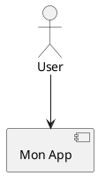
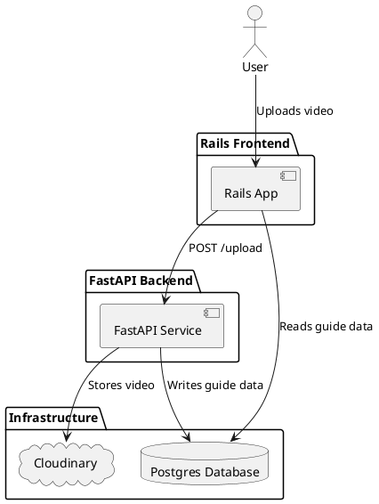
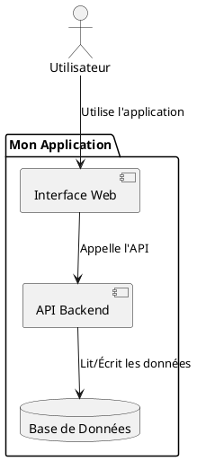

# Guide Complet : Installation et Utilisation PlantUML pour Diagrammes

## 🔧 Installation (à faire UNE SEULE FOIS par machine)

### Étape 1 : Installer Java
```bash
sudo apt update
sudo apt install default-jre
```

### Étape 2 : Installer PlantUML
```bash
sudo apt install plantuml
```

### Étape 3 : Installer l'extension VS Code
Dans VS Code :
1. `Ctrl+Shift+X` (ouvrir les extensions)
2. Rechercher : **PlantUML**
3. Installer l'extension **PlantUML** par jebbs

### Étape 4 : Redémarrer VS Code
Fermer et rouvrir VS Code pour que tout soit pris en compte.

---

## 📝 Utilisation Quotidienne

### Méthode Simple (recommandée)
1. **Ouvrir** un fichier `.puml` dans VS Code
2. **Appuyer sur** `Alt+D`
3. **→ Le diagramme s'affiche automatiquement à côté !**

### Méthode Alternative
1. **Ouvrir** un fichier `.puml` 
2. **Faire** `Ctrl+Shift+P`
3. **Taper** : `PlantUML: Preview Current Diagram`
4. **→ Le diagramme s'affiche dans un panneau**

---

## 📄 Créer un Nouveau Diagramme

### Structure de base d'un fichier `.puml`


### Exemple Concret (votre fichier actuel)
Fichier : `stepwize_plantuml.puml`


---

## 👥 Instructions pour vos Stagiaires

### Vérification que tout fonctionne
1. Ouvrir le fichier `stepwize_plantuml.puml`
2. Appuyer sur `Alt+D`
3. Si le diagramme apparaît → ✅ Tout fonctionne !

### En cas de problème
- Vérifier Java : `java --version` (doit afficher une version)
- Vérifier PlantUML : `plantuml -version`
- Redémarrer VS Code

### Workflow de travail
1. **Créer** un nouveau fichier avec extension `.puml`
2. **Écrire** le diagramme en syntaxe PlantUML
3. **Appuyer** sur `Alt+D` pour voir le résultat
4. **Modifier** le code → la prévisualisation se met à jour automatiquement

---

## 💡 Avantages de cette Solution

✅ **Simple** : Juste `Alt+D`  
✅ **Rapide** : Prévisualisation instantanée  
✅ **Local** : Pas besoin d'Internet  
✅ **Léger** : Pas de Docker  
✅ **Intégré** : Directement dans VS Code  

---

## 🚀 Test Immédiat

### Option 1 : Utiliser l'exemple existant
Ouvrez `stepwize_plantuml.puml` et appuyez sur `Alt+D` → vous devriez voir votre diagramme !

### Option 2 : Créer votre premier fichier exemple
1. **Créer** un nouveau fichier : `mon_premier_diagramme.puml`
2. **Copier-coller** ce code dedans :

3. **Sauvegarder** le fichier
4. **Appuyer sur** `Alt+D`
5. **→ Votre premier diagramme apparaît !**

---

## 📚 Syntaxe PlantUML Utile

### Éléments de base
```plantuml
actor Utilisateur
component Composant
database "Base de Données"
cloud "Service Cloud"
package "Module" {
    component "Sous-composant"
}
```

### Relations
```plantuml
A --> B : "Label"
A -> B
A ..> B : "Optionnel"
A -up-> B : "Vers le haut"
```

### Couleurs et styles
```plantuml
skinparam backgroundColor #EEEBDC
skinparam componentBackgroundColor LightBlue
```